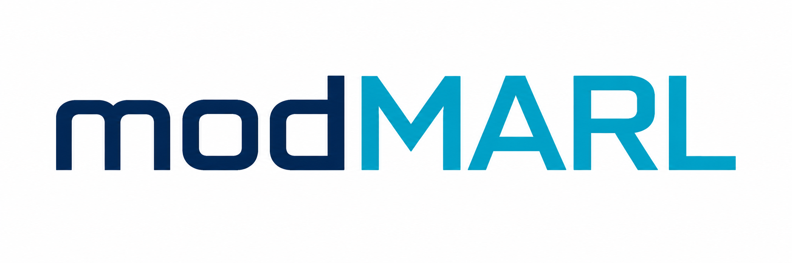
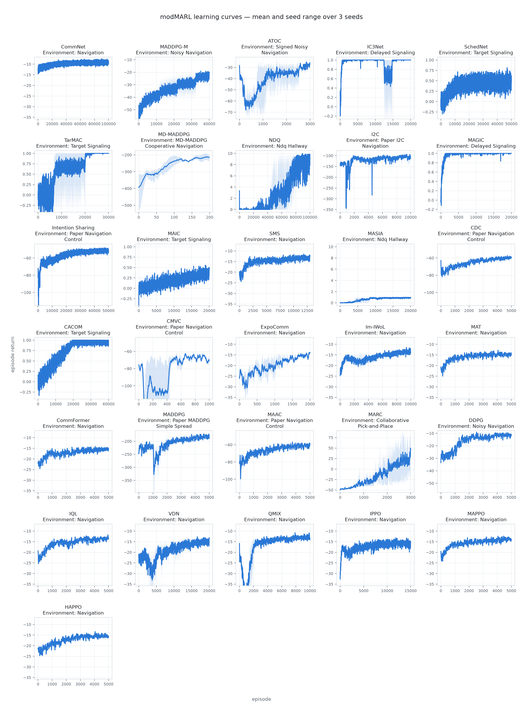

<p align="center">
  <picture>
    <source media="(prefers-color-scheme: dark)" srcset="modMARL-dark.png">
    
  </picture>
</p>

<p align="center">
  <a href="https://github.com/gmontana/modMARL/actions/workflows/ci.yml"></a>
  <a href="LICENSE"></a>
  
</p>

**modMARL** — *modular* multi-agent reinforcement learning — is a curated library of
cooperative MARL algorithms focused on **agent-to-agent communication**, plus the
centralized-critic and independent baselines to compare against. Each algorithm keeps
its defining mechanism in its own module or package, while generic primitives and
communication mechanisms that are not themselves MARL algorithms live in `components/`.

The catalogue spans established baselines and recent communication methods. Start
with **ExpoComm** for sparse messaging, **IWoL** for implicit/explicit coordination,
or **CommFormer** for learned attention graphs. See the
[method guide](guides/choosing_a_method.md) for assumptions and evidence limits.

Implementations have behavioral tests and recorded multi-seed learning evidence.
The [validation table](guides/validation.md) distinguishes passing criteria,
known failures, missing evidence, and available reference comparisons. The curves
are scoped evidence, not a claim that every published benchmark has been reproduced.
New learning checks freeze the task, budget and acceptance rules before three fresh
training seeds. Every seed must improve over its initialized policy and random
actions and meet its task criterion. The linked JSON recipes run on CPU; original
failed results remain available alongside subsequent repairs.

## Install and run

Python 3.11 and 3.12 are tested. For research and modification:

```bash
git clone https://github.com/gmontana/modMARL.git
cd modMARL
python -m venv .venv
source .venv/bin/activate
python -m pip install -e ".[demo]"
python -m modmarl.demo train --episodes 32 --evaluation-episodes 32 --out runs/smoke
```

This CPU-only smoke check saves a checkpoint and verifies that reloading it
reproduces evaluation. It is an execution check, not evidence of learning.
For the full, roughly three-minute introductory comparison on the measured CPU:

```bash
python -m modmarl.demo compare --out runs/signaling
python -m modmarl.demo plot --results runs/signaling --out runs/signaling/figures
```

The example uses TarMAC and IPPO to explain one-shot private-information sharing.
It complements the recent methods in the catalogue; it is not a leaderboard.
Read the [recipe, recorded outcomes, costs and limitations](guides/demo.md).

To install v0.1.1 without a checkout:

```bash
python -m pip install "modmarl[demo] @ https://github.com/gmontana/modMARL/releases/download/v0.1.1/modmarl-0.1.1-py3-none-any.whl"
```

Run the same `python -m modmarl.demo` commands from any directory. The
[release downloads](https://github.com/gmontana/modMARL/releases/tag/v0.1.1)
include the source distribution and checksums; the demo checkpoints are in the
[v0.1.0 release](https://github.com/gmontana/modMARL/releases/tag/v0.1.0). Source installs
and wheels ship both `modmarl` and `marl_envs`. This release is distributed through
GitHub; it is not published on PyPI.

- [Choose a method, including recent MARL work](guides/choosing_a_method.md)
- [Use your own environment](guides/custom_environment.md)
- [Modify communication with ExpoComm](guides/communication.md)
- [Check validation evidence](guides/validation.md)
- [Contribute](CONTRIBUTING.md)

## Algorithms

### Communication methods

| Algorithm | Core idea | Topology | Message type | Reference |
|---|---|---|---|---|
| **CommNet** | Recurrently mean-pool other agents' previous-step hidden states and learn the channel with cooperative REINFORCE. | Complete broadcast | Continuous hidden state | [Sukhbaatar et al., NeurIPS 2016](https://arxiv.org/abs/1605.07736) |
| **MADDPG-M** | Select one agent's observation for a shared medium using a separately rewarded communication policy. | Centralized single-sender medium | Continuous observation | [Kilinc & Montana, NeurIPS DRL WS 2018](https://arxiv.org/abs/1812.00922) |
| **ATOC** | Predict when nearby cooperation is valuable, persist proximity groups, and sequentially integrate overlapping groups with a bidirectional LSTM. | Learned dynamic proximity groups | Continuous action-intention thought | [Jiang & Lu, NeurIPS 2018](https://proceedings.neurips.cc/paper/2018/hash/6a8018b3a00b69c008601b8becae392b-Abstract.html) |
| **IC3Net** | Learn a binary talk gate that controls each sender's contribution to the shared mean. | Gated complete broadcast | Continuous gated hidden state | [Singh et al., ICLR 2019](https://arxiv.org/abs/1812.09755) |
| **SchedNet** | Score agents' communication priority and allow only the top-k senders to broadcast each step. | Centralized top-k broadcast | Continuous encoded state | [Kim et al., ICLR 2019](https://arxiv.org/abs/1902.01554) |
| **TarMAC** | Match receiver queries to sender signatures, attention-pool their values, and optionally reason for multiple rounds before acting. | Dynamic directed attention | Continuous signature-value message | [Das et al., ICML 2019](https://arxiv.org/abs/1810.11187) |
| **MD-MADDPG** | Let agents sequentially read and update a shared memory through LSTM-style gated writes. | Shared sequential memory bus | Continuous memory state | [Pesce & Montana, Mach. Learn. 2020](https://doi.org/10.1007/s10994-019-05864-5) |
| **NDQ** | Regularize pairwise Gaussian messages for action prediction and succinctness, then prune weak channels. | Complete directed pair graph | Stochastic Gaussian latent | [Wang et al., ICLR 2020](https://arxiv.org/abs/1910.05366) |
| **I2C** | Estimate causal influence, request useful observations, and recurrently encode the selected sender slots. | Learned directed request graph | Continuous observation-derived message | [Ding, Huang & Lu, NeurIPS 2020](https://arxiv.org/abs/2006.06455) |
| **MAGIC** | Gumbel-sample who communicates, then integrate scheduled messages with multi-round graph attention. | Learned dynamic directed graph | Continuous graph-attention message | [Niu, Paleja & Gombolay, AAMAS 2021](http://www.ifaamas.org/Proceedings/aamas2021/pdfs/p964.pdf) |
| **Intention Sharing** | Predict an H-step future and attention-compress the imagined trajectory into a shared intention. | Complete broadcast with attention | Continuous trajectory embedding | [Kim, Park & Sung, ICLR 2021](https://openreview.net/forum?id=qpsl2dR9twy) |
| **MAIC** | Use learned teammate models to produce attention-weighted incentives that shift recipients' action values. | Learned directed attention graph | Continuous action-value incentive | [Yuan et al., AAAI 2022](https://ojs.aaai.org/index.php/AAAI/article/view/21179) |
| **SMS** | Estimate each message's sampled Shapley value and prune messages with non-positive predicted utility. | Dynamically pruned directed graph | Continuous value-scored message | [Xue et al., IJCAI 2022](https://www.ijcai.org/proceedings/2022/82) |
| **MASIA** | Aggregate observations into a reconstructive shared latent, then focus it separately for each receiver. | Complete broadcast aggregation | Continuous shared latent | [Guan et al., NeurIPS 2022](https://proceedings.neurips.cc/paper_files/paper/2022/hash/075b2875e2b671ddd74aeec0ac9f0357-Abstract-Conference.html) |
| **CDC** | Build symmetric pair messages and weight them with matrix heat diffusion before action selection. | Learned undirected graph | Continuous pair message | [Pesce & Montana, Mach. Learn. 2023](https://arxiv.org/abs/2002.05233) |
| **CACOM** | Quantize receiver requests, generate personalized helper responses, and retain value-improving directed links. | Broadcast request, directed response | Quantized continuous message | [Li & Zhang, AAMAS 2024](https://arxiv.org/abs/2312.15600) |
| **CMVC** | Predict each sender's counterfactual message value, request only positive contributors, and aggregate them with a CMV-conditioned monotone mixer. | Learned directed request graph | Continuous trajectory embedding | [Gao et al., IEEE TSMC: Systems 2025](https://doi.org/10.1109/TSMC.2025.3604230) |
| **ExpoComm** | Propagate recurrent memory over power-of-two neighbors and ground messages with auxiliary global information. | Fixed sparse exponential graph | Continuous recurrent memory | [Li et al., ICLR 2025](https://openreview.net/forum?id=CL3U0GxFRD) |
| **IWoL** | Distill critic communication and privileged world information into a local latent, or expose the learned Transformer message explicitly. | Dynamic directed training graph; message-free in Im-IWoL | Implicit local latent or explicit continuous message | [Lee et al., arXiv 2025](https://arxiv.org/abs/2509.25550) |

### Reusable communication components

Mechanisms whose source paper defines a communication protocol but no MARL learner.
They live in `modmarl/components/`, have no training script, and are not plotted.

| Component | Mechanism | Learner in the source paper | Reference |
|---|---|---|---|
| **Who2Com** | Request–match–connect handshake: a requester broadcasts a compact query, supporters answer with keys, and general attention scores each pair — softmax-weighted while training, top-one link at execution. | None; the paper trains semantic segmentation with cross-entropy and defines no policy or reward | [Liu et al., ICRA 2020](https://arxiv.org/abs/2003.09575) |

### Sequence-model policies

| Algorithm | Core idea | Topology | Message type | Reference |
|---|---|---|---|---|
| **MAT** | Encode the observation sequence, then autoregressively decode the joint action under multi-agent advantage decomposition. | Complete encoder, causal decoder | Observation and preceding-action latents | [Wen et al., NeurIPS 2022](https://proceedings.neurips.cc/paper_files/paper/2022/hash/69413f87e5a34897cd010ca698097d0a-Abstract-Conference.html) |
| **CommFormer** | Learn a sparse adjacency as both an attention mask and relation embedding, alternating graph and policy optimization. | Learned static directed k-hot graph | Observation and preceding-action latents | [Hu et al., ICLR 2024](https://openreview.net/forum?id=Qox9rO0kN0) |

### Centralized / structured critics

Neither group exchanges messages at execution time, so both tables report training
structure in place of a topology and message type.

| Algorithm | Core idea | Training structure | Reference |
|---|---|---|---|
| **MADDPG** | Train independent local actors against agent-specific critics of the complete joint transition. | Fully centralized critic | [Lowe et al., NeurIPS 2017](https://arxiv.org/abs/1706.02275) |
| **MAAC** | Train local soft actors with an attention critic and agent-specific counterfactual baselines. | Centralized critic attention | [Iqbal & Sha, ICML 2019](https://arxiv.org/abs/1810.02912) |
| **MARC** | Encode entities and typed relations with a relational graph critic during centralized training. | State relational graph critic | [Utke, Houssineau & Montana, AAAI 2025](https://arxiv.org/abs/2412.15388) |

### Baselines (no communication)

| Algorithm | Core idea | Training structure | Reference |
|---|---|---|---|
| **DDPG** | Train independent continuous deterministic actors and local critics using replay, OU exploration, and slowly updated targets. | Independent local actor-critics | [Lillicrap et al., ICLR 2016](https://arxiv.org/abs/1509.02971) |
| **IQL** | Let every agent independently learn a local DQN while teammates remain environmental dynamics. | Independent learners | [Tampuu et al., PLOS ONE 2017](https://arxiv.org/abs/1511.08779) |
| **VDN** | Sum local chosen-action values into the team value without a learned mixer or state. | Additive value factorization | [Sunehag et al., AAMAS 2018](https://arxiv.org/abs/1706.05296) |
| **QMIX** | Monotonically mix local action values into a centralized team value for off-policy learning. | Centralized monotonic mixer | [Rashid et al., ICML 2018](https://arxiv.org/abs/1803.11485) |
| **IPPO** | Optimize each agent with local observations, local values, and independently computed PPO advantages. | Independent local policies | [de Witt et al., 2020](https://arxiv.org/abs/2011.09533) |
| **MAPPO** | Optimize shared local actors with PPO advantages estimated by a centralized value function. | Centralized value, local policy | [Yu et al., NeurIPS 2022](https://arxiv.org/abs/2103.01955) |
| **HAPPO** | Sequentially update heterogeneous actors while carrying forward a multiplicative importance correction. | Sequential independent policies | [Zhong et al., JMLR 2024](https://www.jmlr.org/papers/v25/23-0488.html) |

### Implementation notes

Where a paper leaves a choice open or its release contradicts its own text, the module
docstring records the reconciliation in full. Two cases affect what the tables above mean:

- **CommFormer** follows the ICLR proceedings as its primary specification; the
  [extended arXiv version](https://arxiv.org/abs/2411.00382) supplies architecture context
  only, and the later temporal-gating extension is not folded in. It implements the released
  `commformer_dec` configuration — the one every published experiment script uses — so the
  learned adjacency masks attention and each agent owns its action head. Four quirks of that
  release are reproduced rather than tidied away, marked where they occur in
  `modmarl/algorithms/commformer.py`: the relation embedding is read transposed, the relation
  branch is scaled twice, the added self loop doubles each agent's own attention, and warmup
  passes the raw edge parameter.
- **IWoL** includes both paper variants. Im-IWoL uses its graph-attention protocol only as a
  training teacher and executes without messages, while Ex-IWoL independently schedules actor
  and critic communication. The learning figure validates the paper's primary implicit
  variant; its per-seed JSON records a zero execution communication rate.
- **ATOC** has no author code release. Its package follows the NeurIPS equations and stated
  architecture directly; the paper leaves three actor widths, the attention/BiLSTM widths,
  group cap, initialization scale, and BatchNorm placement open, so those choices are explicit
  rather than attributed to a nonexistent release.
- **CMVC** links to `GaoZiHong/CMVC`, but that repository is empty. Its package therefore
  follows the journal equations directly and records every underspecified architecture and
  schedule choice—including the absent-action encoding, selector/mixer widths, communication
  warmup, and hard-target interval—in `CMVCConfig` and the module design block.

## Learning-curve validation

The learning curves below show mean episode return and the seed range over three runs
for each algorithm. Every panel names its environment explicitly. Implementations are
also checked by behavioral unit tests and seeded learning regressions. The exact per-seed
inputs are retained in `figures/curve_data/` and `figures/validation_data/`.
The inventory selects each method's current evidence, preserving earlier failures.
Rebuild both images with
`python tools/plot_curves.py --inventory validation/inventory.json --out figures --require-complete`.
Reproduce the new confirmation panels with the frozen recipes linked in the
[validation table](guides/validation.md). Run learning regressions with
`pytest -o addopts='' -m slow` (the override removes the default fast-only marker).

Training returns include exploration. Use the [validation table](guides/validation.md)
for final policy evaluation and current confirmation results. Different tasks,
budgets and settings make this a learning demonstration, not a method ranking.

The original curve recipes remain in `tools/train_curves.py`; use a new output
directory when rerunning them to preserve the recorded evidence.

<p align="center">
  <picture>
    <source media="(prefers-color-scheme: dark)" srcset="figures/training_curves_dark.png">
    
  </picture>
</p>

## Layout

- `modmarl/` — the library, environment-agnostic:
  - `algorithms/` — one self-contained module or package per algorithm
  - `components/` — reusable primitives and non-algorithm communication mechanisms such as Who2Com
  - `common/` — replay buffer, metrics, network helpers
- `marl_envs/` — a standalone, reusable environment package (see below)
- `examples/` — runnable training scripts, one per algorithm

## Environments

Environments live in a **separate, framework-agnostic `marl_envs` package** — deliberately not
tied to modMARL, so any MARL library can use it. The `modmarl` algorithms are
environment-agnostic (they take `obs_dim`/`action_dim`). Both packages currently ship
and version together in the same distribution. `make_env(name, n_agents, horizon, seed)` builds every registered environment
behind one contract (`reset`/`step`, `obs_dim`, `num_actions`); `marl_envs.ENV_CHOICES` lists
the registered names.

We prefer standard environments and add our own only where a method needs a setting the
standard suites don't provide:

| Environment | What it is |
|---|---|
| **[PettingZoo MPE](https://github.com/Farama-Foundation/PettingZoo)** — `simple_spread_pz` | The standard cooperative-navigation benchmark, via an optional install. |
| **[Lightweight particle tasks](https://github.com/openai/multiagent-particle-envs)** — `navigation`, `formation`, `line`, `pack`, `simple_spread` | Dependency-free reimplementations of the MPE-style tasks, for zero-setup quick runs. |
| **Published particle scenarios** — the `paper_*` names | The original MPE scenarios at the settings the papers published on (CDC, I2C, MADDPG, MD-MADDPG). A copy of OpenAI's MIT-licensed [multiagent-particle-envs](https://github.com/openai/multiagent-particle-envs), ported to gymnasium, is vendored under `marl_envs/vendors/` together with the CDC/MD-MADDPG authors' own scenarios so those curves stay reproducible; `marl_envs/vendors/multiagentsha/NOTICE.md` lists every modification and each scenario's origin. |
| **[Hallway](https://github.com/TonghanWang/NDQ)** — `ndq_hallway`, `maic_hallway` | The didactic task NDQ introduced for its communication bottleneck, so NDQ and MAIC can be validated without StarCraft II. |
| **[MACPP](https://github.com/gmontana/CollaborativePickAndPlaceEnv)** — via `MACPPEnv` | A grid-world collaborative pick-and-place task, used by MARC. We ship a thin adapter to the common contract, not a copy — `pip install` it to enable. |
| **Noisy navigation** — via `NoisyNavigationEnv` | Cooperative navigation where only a "gifted" agent sees the true landmarks; the setting MADDPG-M and DDPG are compared on. Ours. |
| **Target signaling** — `target_signaling` | A bounded one-step leader/follower game used to validate TarMAC's current-step multi-round communication. Ours. |
| **Bridge navigation** — `bridge_navigation`, `hidden_gate_bridge*` | Navigation through a narrow corridor, optionally with a gate bit only one side can observe — diagnostic information-bottleneck tasks. Ours. |

`MACPPEnv` and `NoisyNavigationEnv` are constructed directly by the examples that need them
rather than through `make_env`: the first depends on an optional package, the second is
specific to the two algorithms compared on it.

## Acknowledgements

Source releases used to verify these implementations, in table order. Each module
docstring pins the exact revision it was reconciled against.

- **[CommNet](https://github.com/facebookarchive/CommNet)**
- **[IC3Net](https://github.com/IC3Net/IC3Net)**
- **[SchedNet](https://github.com/rhoowd/sched_net)**
- **[NDQ](https://github.com/TonghanWang/NDQ)**
- **[I2C](https://github.com/PKU-AI-Edge/I2C)**
- **[MAGIC](https://github.com/CORE-Robotics-Lab/MAGIC)**
- **[MAIC](https://github.com/mansicer/MAIC)**
- **[SMS](https://github.com/DiXue98/SMS)**
- **[MASIA](https://github.com/chenf-ai/MASIA)**
- **[CACOM](https://github.com/LXXXXR/CACOM)**
- **[ExpoComm](https://github.com/LXXXXR/ExpoComm)**
- **[IWoL](https://github.com/DongsuLeeTech/IWoL)**
- **[Who2Com](https://github.com/GT-RIPL/MultiAgentPerception)**
- **[MAT](https://github.com/PKU-MARL/Multi-Agent-Transformer)**
- **[CommFormer](https://github.com/charleshsc/CommFormer)**
- **[MADDPG and DDPG](https://github.com/openai/maddpg)**
- **[MAAC](https://github.com/shariqiqbal2810/MAAC)**
- **[MARC](https://github.com/sharlinu/MARC)**
- **[IQL](https://github.com/NeuroCSUT/DeepMind-Atari-Deep-Q-Learner-2Player)**
- **[VDN](https://github.com/Louiii/ValueDecomposition)**
- **[QMIX](https://github.com/oxwhirl/pymarl)**
- **[IPPO](https://github.com/Denys88/rl_games)**
- **[MAPPO](https://github.com/marlbenchmark/on-policy)**
- **[HAPPO](https://github.com/PKU-MARL/HARL)**

All of these are the paper authors' own releases except VDN and IPPO, where the authors
released nothing and a third-party implementation supplies the training details.

ATOC, CDC, MD-MADDPG, Intention Sharing, TarMAC and MADDPG-M have no public code release.
CDC, MD-MADDPG and Intention Sharing were reconciled against the authors' unreleased code,
pinned by revision hash in the module docstrings; those repositories are private, so the
docstrings state each divergence in full rather than asking the reader to check. CMVC's
paper-linked repository exists but contains no files. Each module design block records what
its implementation was reconciled against and which details the paper leaves open.

## Source examples

```bash
python examples/train_expocomm.py --env navigation --episodes 8
python examples/train_commnet.py
```

The eight-episode ExpoComm command checks execution only.
`examples/train_commnet.py` trains CommNet on a cooperative MPE task and saves a
checkpoint. It is a complete training loop that uses only the public API; the other
algorithms follow the same pattern.
