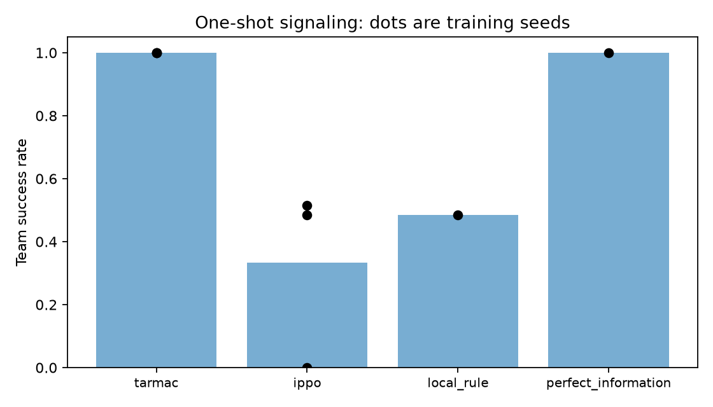

# Reproduce the signaling example

Three agents make one simultaneous binary decision. Only the leader sees the
random target bit. Return rewards the fraction of correct decisions; **team
success** requires all three to be correct. TarMAC has two internal communication
rounds before its action. IPPO applies a shared local policy independently to
each observation; its followers cannot observe the bit. One environment step
does not imply one internal communication round.

After installing the package with its `demo` extra:

```bash
python -m modmarl.demo train --episodes 32 --evaluation-episodes 32 --out runs/smoke
python -m modmarl.demo train --algorithm tarmac --out runs/tarmac
python -m modmarl.demo evaluate --checkpoint runs/tarmac/checkpoint.pt --out runs/tarmac-evaluation.json
python -m modmarl.demo compare --out runs/signaling
python -m modmarl.demo plot --results runs/signaling --out runs/signaling/figures
```

Use a new output directory for each training attempt; commands reject overwriting
existing runs. `plot` can also read a single training-run directory. Plotting uses
only result JSON and does not need checkpoints. Evaluation needs a checkpoint, not
the source checkout. Existing weight-only checkpoints without reconstruction metadata
remain loadable through their original algorithm APIs, but cannot be inferred by this CLI.

## Frozen comparison

- Methods: TarMAC and IPPO, existing native training defaults. TarMAC uses two rounds.
- Budget: 30,000 one-step episodes each; training seeds 101, 103, 107.
- Evaluation: deterministic policies on the same 500 environment seeds, 100000–100499.
- Acceptance: TarMAC team success at least 80% on **each** training seed. `compare`
  exits unsuccessfully if that gate fails, after preserving all six results.
- References: a local rule (leader answers its bit, followers guess zero) and a
  perfect-information oracle. The oracle explicitly has additional information.

With a fair target bit, a message-free team succeeds at most half the time in
expectation: the followers' information is independent of the bit. The local rule
attains this bound. Finite evaluation samples need not contain exactly equal counts
of the two bits. A trained message-free policy can do worse because optimization
does not guarantee that its agents adopt the same guess.

The recipe fixes architectures and optimizers rather than tuning them for equal
performance. It demonstrates an information restriction and a working research
workflow; it is **not a general ranking or a controlled comparison of optimizers**.
The introductory methods do not define the library's contemporary research scope:
see [recent methods and controls](choosing_a_method.md).

## Results and cost

The initial implementation verification used CPU, one PyTorch thread, Python
3.11.16 and PyTorch 2.14.0+cpu. TarMAC achieved 100% success on all three seeds;
IPPO achieved 48.4%, 51.6%, and 0%. All results, including the failed IPPO run, are
retained. The 32-episode smoke took 2.7 seconds, the 3,000-episode development pilot
3.1 seconds, and the six full runs about 162 seconds in total, excluding interpreter
startup and artifact reporting. Runtime and seeded outcomes can change with hardware
or dependencies. The smoke and pilot are not learning evidence.

See [the labbook](../LABBOOK.md) for subsequent verification, and
`figures/demo_data/` for the published raw results. Rebuild their figure with:

```bash
python -m modmarl.demo plot --results figures/demo_data --out runs/published-figure
```



Bars show mean team success; dots on trained methods show individual training
seeds (coincident dots overlap). Each reference is evaluated once, without training.

Each run saves `result.json`, `checkpoint.pt`, `training.log`, an environment
snapshot, and a metadata sidecar. The JSON contains raw training/evaluation outcomes,
resolved settings and source hashes; the sidecar links checkpoint hashes, runtime
versions and Git state when available. A wheel install records the package version
and source hashes even without Git. These checkpoints support **evaluation**, not
exact continuation of training. Full evaluation checkpoints are included in the
[demonstration release archive](https://github.com/gmontana/modMARL/releases/download/v0.1.0/modmarl-0.1.0-demo.zip)
alongside the wheel. The saved training runs retain their original source hashes;
the release package also includes a later provenance compatibility fix, which does
not change the training algorithms.

## Troubleshooting

- Use Python 3.11 or 3.12 for the tested installation path.
- Install `modmarl[demo]` (or `.[demo]` in a checkout) if plotting reports missing matplotlib.
- The demo uses CPU and one thread by default; no CUDA or optional simulator is needed.
- A short run can have low success. Use the full frozen recipe to assess learning.
- For other tasks, use their source examples. This command deliberately supports only
  the signaling demonstration; it is not a universal trainer.
